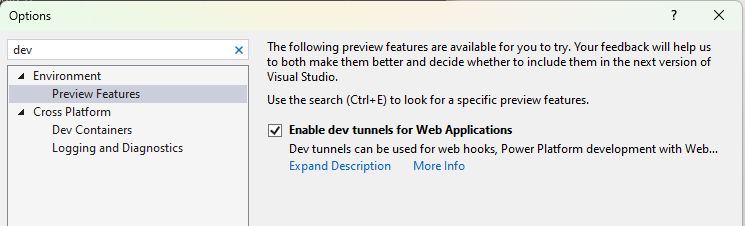

|page_type|languages|products
|---|---|---|
|sample|<table><tr><td>csharp</tr></td></table>|<table><tr><td>azure</td><td>azure-communication-services</td></tr></table>|

# Call Automation full sample

In this sample, I cover how you can use Call Automation SDK with all its features.

# Design

Outbound design 

Inbound design 

## Prerequisites

- Create an Azure account with an active subscription. For details, see [Create an account for free](https://azure.microsoft.com/free/)
- Create an Azure Communication Services resource. For details, see [Create an Azure Communication Resource](https://docs.microsoft.com/azure/communication-services/quickstarts/create-communication-resource). You will need to record your resource **connection string** for this sample.
- Get a phone number for your new Azure Communication Services resource. For details, see [Get a phone number](https://learn.microsoft.com/en-us/azure/communication-services/quickstarts/telephony/get-phone-number?tabs=windows&pivots=programming-language-csharp)

- Create and host a Azure Dev Tunnel. Instructions [here](https://learn.microsoft.com/en-us/azure/developer/dev-tunnels/get-started)
- [.NET7 Framework](https://dotnet.microsoft.com/en-us/download/dotnet/7.0) (Make sure to install version that corresponds with your visual studio instance, 32 vs 64 bit)
- To enable dev tunneling, Click `Tools` -> `Options` in Visual Studio 2022.  In the search bar type tunnel, Click the checkbox under `Environment` -> `Preview Features` called `Enable dev tunnels for Web Application`
	 
- Create `Dev Tunnels`, for more details about [Dev Tunnels.](https://learn.microsoft.com/en-us/aspnet/core/test/dev-tunnels?view=aspnetcore-7.0)  
	   
	 

## Before running the sample for the first time

1. Open an instance of PowerShell, Windows Terminal, Command Prompt or equivalent and navigate to the directory that you'd like to clone the sample to.
2. git clone https://github.com/ibrahimmalhas/ACS-CA-FullSample.git.
3. Open the Program.cs file to configure the following settings:
- `acsConnectionString`: Azure Communication Service resource's connection string.
- `acsPhonenumber`: Phone number associated with the Azure Communication Service resource. For e.g. "+1425XXXAAAA"
- `targetPhonenumber`: Target phone number to add in the call. For e.g. "+1425XXXAAAA"
- `callbackUriHost`: Base url of the app. (For local development replace the dev tunnel url)
- `ParticipantToAdd`: Phone number to add participant function

### Locally running the Call Automation Sample
1. Go to CallAutomation_SimpleIvr folder and open `CallAutomationApp.sln` solution in Visual Studio.
2. Visual studio dev tunnel url - Run the solution once and check for dev tunnels being created, select to continue on security prompt.
	
### Create Webhook for Microsoft.Communication.IncomingCall event
IncomingCall is an Azure Event Grid event for notifying incoming calls to your Communication Services resource. To learn more about it, see [this guide](https://learn.microsoft.com/en-us/azure/communication-services/concepts/call-automation/incoming-call-notification). 
1. Navigate to your resource on Azure portal and select `Events` from the left side menu.
1. Select `+ Event Subscription` to create a new subscription. 
1. Filter for Incoming Call event. 
1. Choose endpoint type as web hook and provide the public url generated for your application by Dev Tunnels. Make sure to provide the exact api route that you programmed to receive the event previously. In this case, it would be <dev_tunnel_url>/api/incomingCall.  

	

1. Select create to start the creation of subscription and validation of your endpoint as mentioned previously. The subscription is ready when the provisioning status is marked as succeeded.

This subscription currently has no filters and hence all incoming calls will be sent to your application. To filter for specific phone number or a communication user, use the Filters tab.

4. Detailed instructions on publishing the app to Azure are available at [Publish a Web app](https://docs.microsoft.com/visualstudio/deployment/quickstart-deploy-to-azure?view=vs-2019).

**Note**: While you may use http://localhost for local testing, the sample when deployed will only work when served over https. The SDK [does not support http](https://docs.microsoft.com/azure/communication-services/concepts/voice-video-calling/calling-sdk-features#user-webrtc-over-https).

### Troubleshooting

1. Solution doesn't build, it throws errors during build

	Clean/rebuild the C# solution

